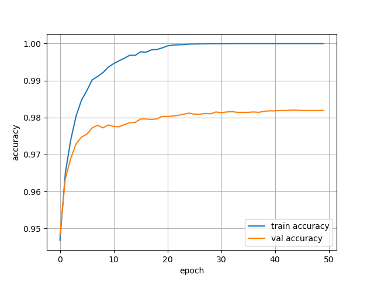

# MLP-implementation-with-numpy

The implementation of a fully connected NN with pure numpy.

## Example
Start with a multi-class classification problem. Use MNIST dataset(60000 train samples and 10000 test samples) as an example. 

Construct a MLP with two hidden layers. One has 256 neurons, another has 64 neurons. The accuracy on testset reaches 0.9819 after 50 epochs. For details, please refer to example.py.

## Environment

* Numpy
* python=3.6.12

## Usage

	from NN import Dense, Model
	MLP = Model(0.1)
	MLP.add(Dense(100,64,activation='relu'))
	MLP.add(Dense(64,10,activation='None'))
	
## Todo
* Add loss functions.
* Add tanh and ohter activations.
* Add optimizers.
* Add learning rate decay.

## Reference

* [Machine Learning for Beginners: An Introduction to Neural Networks](https://victorzhou.com/blog/intro-to-neural-networks/)
* [A Derivation of Backpropagation in Matrix Form](https://sudeepraja.github.io/Neural/)